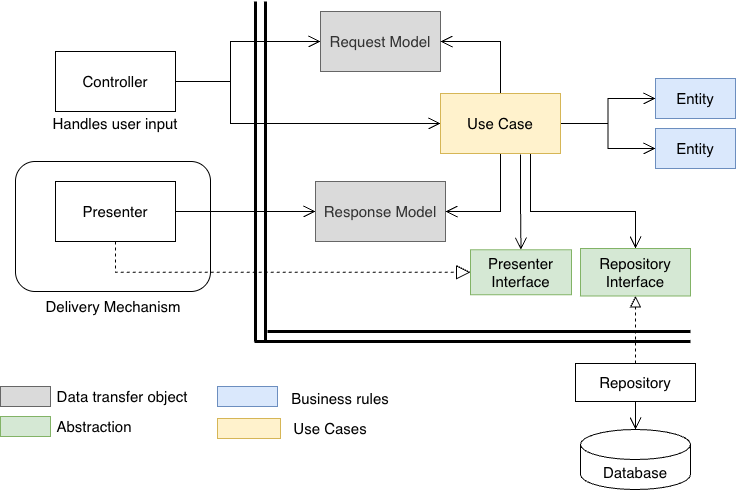
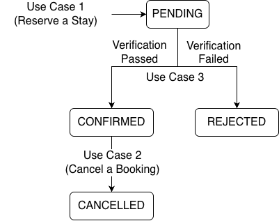

# Clean Architecture Studio

## Overview

You'll build three features (three "user stories") for **CozyStay**, a small short-term home rental app (like a scaled-down Airbnb). All three follow the same process we observed in the [Clean Architecture Visualization](https://cse4504-wustl.github.io/clean_architecture_trace/).

These features will be implemented across the components of Clean Architecture that live **inside** the double line boundary (as shown in the diagram below).
<p align="center">

</p>

- **Part A (Reserve a Stay)** is heavily scaffolded. You'll fill in blanks in mostly-complete code, with an explanation for every blank tied back to a specific box in the diagram.
- **Part B (Cancel a Booking):** you're on your own. You get the user story, the acceptance criteria, and a checklist of what classes you need, no code skeleton.
- **Part C (Confirm a Pending Booking):** also on your own, but this one introduces something new: a call to an **external service** (not your database, not your UI). You'll design a third kind of abstraction to keep that call from breaking the Dependency Rule.

**These three parts share one thing: a single `Booking` entity that moves through a small lifecycle as you complete each part.** Part A creates one. Part C decides whether it gets confirmed or rejected. Part B lets a guest cancel one. None of the three Use Cases call each other directly — they coordinate only through what gets saved to, and read back from, the `Booking` Repository.

The diagram below shows how Booking transitions between different states, and which user story triggers each state transition.



## Your Task
As you work through each user story, add formatted code to this README.md file, in the space provided.

## AI Usage Policy
It is important that you work through this studio yourselves, without the help of GenAI. The learning objective of this studio is to practice designing an application using clean architecture. Using GenAI on this studio would prevent you from achieving this learning objective.

You can use GenAI for Java specific questions, spelling, formatting (anything that's not related to the design of this application).

## CozyStay Requirements (short version)

CozyStay lets guests reserve stays at listings (properties) owned by hosts. Below are the requirements as user stories, plus the business rules. Read all of it before writing any code. As you work through the user stories, you will need to decide which rule belongs to which entity.

### The Booking lifecycle

A booking can be cancelled (Story 2) from either `PENDING` or `CONFIRMED` — a guest might change their mind before verification even finishes. It cannot be cancelled from `REJECTED` (there's nothing left to cancel) or from `CANCELLED` (already done).

### User Story 1 — Reserve a Stay

> As a guest, I want to reserve a listing for a range of dates, so that I can hold my stay and see the total price while it's pending confirmation.

**Acceptance criteria:**
- The guest provides a listing ID, their guest ID, a check-in date, and a check-out date.
- The system rejects a stay shorter than a listing's minimum-nights requirement.
- The total price is: `(nightly rate × number of nights) + cleaning fee`.
- On success, a new booking is created in a **pending** state and saved, and the guest sees a reference code and the total price. This reserves the dates and starts the process — it doesn't confirm the stay. That's Story 3.

### User Story 2 — Cancel a Booking

> As a guest, I want to cancel an existing booking, so that I get whatever refund I'm entitled to based on how close it is to my check-in date.

**Acceptance criteria:**
- The guest provides a booking ID.
- The refund amount depends on how far in advance the cancellation happens (see business rules below).
- A booking can only be cancelled from `PENDING` or `CONFIRMED` status.
- On success, the guest sees the refund amount and a confirmation that the booking is cancelled.
- A booking that's already cancelled, or that was rejected during identity verification, can't be cancelled.

### User Story 3 — Confirm a Pending Booking

> As a host, I want a guest's pending booking to be automatically confirmed once their identity is verified — or rejected if it isn't — so that I can trust who is staying at my property before their stay is locked in.

**Acceptance criteria:**
- The system is given the ID of a pending booking (this runs as its own step, sometime after Story 1 creates the booking — not as part of the same request).
- If the guest already qualifies as trustworthy (3+ completed past stays, 0 cancellations), the booking is confirmed immediately, with no call to TrustCheck.
- Otherwise, the system calls **TrustCheck**, a real third-party identity verification API, sending the guest's name and government ID number, and receives back a verification result.
- If TrustCheck passes the guest, the booking's status becomes confirmed.
- If TrustCheck fails the guest, the booking's status becomes rejected, along with a reason.
- Either way, the guest sees the final status of their booking.

### Business rules
1. A stay's total price is nightly rate × nights, plus a flat cleaning fee.
2. A listing has a minimum-nights requirement; stays shorter than that aren't allowed.
3. Cancellation refund policy: full refund if cancelled 7+ days before check-in; 50% refund if cancelled 3–6 days before check-in; no refund if cancelled fewer than 3 days before check-in, or if check-in has already passed.
4. A booking can only be cancelled while its status is pending or confirmed. A booking that's already cancelled, or that was rejected during identity verification, cannot be cancelled.
5. A guest with 3+ completed stays and 0 cancellations is automatically considered "trustworthy" and doesn't need identity verification.
6. Identity verification, when it *is* needed, is decided by an external service — CozyStay does not do this check itself. Whether a guest is "trustworthy" (Rule 5), however, is a fact CozyStay already knows from its own records.

*(Rule 6 is a bit of a trick — hold onto it until Part C.)*

---

## Part A — Reserve a Stay (fully guided)

### Step 0: A design decision — how should failure be communicated?

Before writing any DTOs, decide something that shapes all of them: when a booking request is invalid (say, the stay is shorter than the minimum), how should `ReserveStayUseCase` say so?

Three options come to mind, and it's worth ruling two of them out on purpose:

- **Throw an exception.** This works, but think about who catches it. It won't be the Presenter — exceptions don't travel through interface method calls the way a return value does, they travel up the call stack to whoever called `reserveStay`, which is the Controller. Now the Controller has to decide what to tell the user about *why* the booking failed — but "deciding what to tell the user" is presentation logic, and the Controller isn't supposed to do presentation.
- **Return a boolean.** Even worse: now the Controller doesn't even get a reason, just a yes/no. It would have to invent its own guess at a failure message, or maintain its own copy of "why bookings fail," which duplicates knowledge that should live in one place.
- **Let the Response Model carry the outcome, success or failure, through the same Presenter Interface.** This is the one that keeps a single channel: the Use Case always talks to the outside world exactly one way — through the Presenter — whether the news is good or bad.

We'll use the third option for every use case in this activity. Concretely, that means the Presenter Interface gets **two** methods instead of one — one for success, one for failure — and the Use Case picks which to call instead of throwing or returning a status code.

**Note:** this doesn't mean exceptions disappear entirely. Reserve them for things that indicate a bug or a broken invariant, such as a `null` request, or a listing ID that should exist but doesn't. "This stay is too short" isn't a bug; a real guest will trigger it constantly through normal use, so it deserves a normal result, not exceptional control flow.

### Step 1: Identify the DTOs

Every use case starts with: what does the Controller hand in, and what does the Use Case hand back? Notice there are two possible outcomes on the way out, and each gets its own DTO. Review the DTOs below:

```java
public class ReserveStayRequestModel {
    public final String listingId;
    public final String guestId;
    public final LocalDate checkIn;
    public final LocalDate checkOut;

    public ReserveStayRequestModel(String listingId, String guestId, LocalDate checkIn, LocalDate checkOut) {
        this.listingId = listingId;
        this.guestId = guestId;
        this.checkIn = checkIn;
        this.checkOut = checkOut;
    }
}

public class ReserveStayResponseModel {
    public final String referenceCode;
    public final double totalPrice;
    public final int nights;

    public ReserveStayResponseModel(String referenceCode, double totalPrice, int nights) {
        this.referenceCode = referenceCode;
        this.totalPrice = totalPrice;
        this.nights = nights;
    }
}

public class BookingFailureResponseModel {
    public final String reason;

    public BookingFailureResponseModel(String reason) {
        this.reason = reason;
    }
}
```

**Notice:** all three classes are pure data, no logic — that's what makes them gray boxes (DTOs) in our Clean Architecture Diagram. `BookingFailureResponseModel` is deliberately its own small DTO rather than a nullable field bolted onto `ReserveStayResponseModel` — that way neither class has to carry fields that are meaningless depending on how things turned out.

### Step 2: Identify the interfaces this Use Case needs

Three abstractions this time — one to read Listing data, one to save the Booking this use case creates, and one for output. Notice a Use Case can depend on more than one Repository Interface; each is scoped to a single Entity, not to a single Use Case.

```java
public interface ListingRepositoryInterface {
    Listing findById(String listingId);
}

public interface BookingRepositoryInterface {
    void save(Booking booking);
    Booking findById(String bookingId);
}

public interface BookingPresenterInterface {
    void presentReservationReceived(ReserveStayResponseModel response);
    void presentBookingFailure(BookingFailureResponseModel failure);
}
```

**Notice:** `BookingPresenterInterface` has two methods, matching the two DTOs from Step 1 — the Use Case is still only ever depending on one interface, it just has two ways of calling into it. `BookingRepositoryInterface` will be reused, unmodified, in both Part B and Part C — they'll add no new methods to it beyond what's here, since `save` and `findById` are all any of the three use cases need to read or update a `Booking`.

**ASK yourself:** why does the Use Case get a `Listing` back from the repository, but never talks to a database directly? *(Same reason as the lecture example — "how listings are stored" is a detail that lives past the horizontal boundary, and the Use Case isn't allowed to depend on it.)*

### Step 3: The Entity — fill in the business rule

This is where Business Rules #1 and #2 belong. `Listing` is a business concept (a property with a nightly rate, a cleaning fee, and a minimum stay), so its own rules about pricing and minimum stay belong on it, not in the Use Case.

```java
public class Listing {
    private final String id;
    private final double nightlyRate;
    private final double cleaningFee;
    private final int minimumNights;

    public Listing(String id, double nightlyRate, double cleaningFee, int minimumNights) {
        this.id = id;
        this.nightlyRate = nightlyRate;
        this.cleaningFee = cleaningFee;
        this.minimumNights = minimumNights;
    }

    // TODO 1: Given a number of nights, return true if that stay is long
    // enough to be bookable at this listing. (Business Rule #2)
    public boolean meetsMinimumStay(int nights) {
        // your code here
    }

    // TODO 2: Given a number of nights, calculate and return the total
    // price for the stay, including the cleaning fee. (Business Rule #1)
    public double calculateTotalPrice(int nights) {
        // your code here
    }
}
```

**Why this matters:** if CozyStay later changes how cleaning fees work (say, a percentage instead of a flat fee), you'd change exactly one method, on exactly one class — and `ReserveStayUseCase` wouldn't need to change or even be recompiled.

### Step 3b: A second Entity — `Booking` (given complete, for now)

`Booking` is what Story 1 actually creates. It's given to you as a plain data-and-status holder here — you're not implementing any of its behavior yet. Parts B and C will each come back and add a method to this same class (`cancel(...)` and `confirm()`/`reject(...)`), so don't consider it "finished" once Part A is done — it's the one class that grows across all three parts of this activity.

```java
public class Booking {
    public enum Status { PENDING, CONFIRMED, REJECTED, CANCELLED }

    private final String id;
    private final String listingId;
    private final String guestId;
    private final LocalDate checkIn;
    private final LocalDate checkOut;
    private final double totalPrice;
    private Status status;

    public Booking(String id, String listingId, String guestId,
                    LocalDate checkIn, LocalDate checkOut, double totalPrice) {
        this.id = id;
        this.listingId = listingId;
        this.guestId = guestId;
        this.checkIn = checkIn;
        this.checkOut = checkOut;
        this.totalPrice = totalPrice;
        this.status = Status.PENDING;
    }

    public String getId() { return id; }
    public String getGuestId() { return guestId; }
    public LocalDate getCheckIn() { return checkIn; }
    public Status getStatus() { return status; }

    // Parts B and C add methods here — cancel(...), confirm(), reject(...) —
    // along with whatever internal state-transition rules they need.
}
```

**Notice:** every `Booking` starts life in `PENDING` status. Nothing in `ReserveStayUseCase` ever sets it to `CONFIRMED` — that's Story 3's job, acting on this same object later, after it's been saved and looked back up.

### Step 4: The Use Case — fill in the orchestration

The Use Case's job is *not* to contain the pricing rule — it's to call the right things in the right order and hand off the result. Notice how little logic lives here; that's intentional.

```java
public class ReserveStayUseCase {
    private final ListingRepositoryInterface listingRepository;
    private final BookingRepositoryInterface bookingRepository;
    private final BookingPresenterInterface presenter;

    public ReserveStayUseCase(ListingRepositoryInterface listingRepository,
                            BookingRepositoryInterface bookingRepository,
                            BookingPresenterInterface presenter) {
        this.listingRepository = listingRepository;
        this.bookingRepository = bookingRepository;
        this.presenter = presenter;
    }

    public void reserveStay(ReserveStayRequestModel request) {
        // TODO 3: Ask the Listing repository for the Listing. Which method do
        // you call, and on which object? (Hint: look at Step 2.)
        Listing listing = ___________________;

        int nights = (int) ChronoUnit.DAYS.between(request.checkIn, request.checkOut);

        // TODO 4: Use the Listing's own method to check the minimum-stay rule.
        // If it fails, this is an expected business outcome, not a bug — per
        // Step 0, report it through the Presenter Interface's failure method,
        // then return, instead of throwing.
        if (!listing.meetsMinimumStay(nights)) {
            ___________________.presentBookingFailure(
                new BookingFailureResponseModel("Stay is shorter than the minimum for this listing."));
            return;
        }

        // TODO 5: Use the Listing's own method to get the total price.
        // Do NOT recompute the price formula here — call the method you wrote in Step 3.
        double totalPrice = ___________________;

        String referenceCode = "CZY-" + UUID.randomUUID().toString().substring(0, 8).toUpperCase();

        // A new Booking always starts PENDING — see Step 3b. Nothing here sets
        // it to CONFIRMED; that happens later, in a completely separate use
        // case (Story 3), acting on this same object after it's saved.
        Booking booking = new Booking(
            referenceCode, request.listingId, request.guestId,
            request.checkIn, request.checkOut, totalPrice);

        // TODO 6: persist the Booking you just created. You will need it
        // for other use cases later
        ___________________.save(booking);

        ReserveStayResponseModel response = new ReserveStayResponseModel(referenceCode, totalPrice, nights);

        // TODO 7: Hand the response to the correct object.
        ___________________.presentReservationReceived(response);
    }
}
```

## Part B — Cancel a Booking (your turn)

No skeleton this time. Use Part A as your template for *shape*, but work out the pieces yourself.

**This is not a new Entity or a new Repository Interface.** `Booking` and `BookingRepositoryInterface` already exist from Part A — this feature extends the same `Booking` class with a new method (something like `cancel(LocalDate today)`), and reuses `BookingRepositoryInterface.findById` / `.save` as-is, unmodified. If you find yourself writing a second Repository Interface for `Booking`, stop. Here, the abstraction should be shared, not duplicated.

**What you need to produce**, embedded as formatted Java code in this README.md file:

- A **Request Model** — what does the Controller need to hand in to cancel a booking?
- A **Response Model** for success — what does the guest need to see when the cancellation goes through?
- A **failure Response Model** — you can reuse `BookingFailureResponseModel` from Part A if a plain "reason" string is all you need, or write your own if cancellation failures need more detail than that.
- A **Presenter Interface** with two methods — success and failure — following the same pattern as `BookingPresenterInterface` in Part A. (You can reuse `BookingPresenterInterface` itself if a "cancellation confirmed" outcome fits its existing methods well enough, or add a new interface if it doesn't — your call, but be ready to justify it.)
- A new method on the **`Booking` entity** — not in the Use Case — implementing the refund rule and the cancellable-status check. Business Rules #3 and #4 belong here. Copy the `Booking` class from Part A to Part B and update it with the new method.
- The **Use Case**, which should mostly just: fetch the booking via `BookingRepositoryInterface.findById`, ask the booking to cancel itself (or compute its own refund), save the change via `BookingRepositoryInterface.save`, and hand the result — success or failure — to the presenter.

**Hints:**
- Business Rule #4 ("only PENDING or CONFIRMED bookings can be cancelled") is a great candidate for a check that lives *inside* `Booking`, not as an `if` statement in the Use Case. Ask yourself: is "can this booking currently be cancelled?" a fact about the business, or a fact about how a screen happens to be built? That answers where the check belongs.
- That same rule is also a good test of the Step 0 decision from Part A: when a guest tries to cancel a booking that's already `CANCELLED` or `REJECTED`, does your Use Case throw, or does it report the outcome through the Presenter Interface like every other expected failure? Stay consistent with Part A's answer.
- Don't reuse `ReserveStayResponseModel` for the success case — a cancellation returns different information than a new reservation does. A separate use case gets its own DTOs, even if some fields look similar.

```java
// TODO: Place your Java code here

```

---

## Part C — Confirm a Pending Booking (your turn, with a new wrinkle)

This use case does two new things at once: it acts on a `Booking` that Part A already created and saved (rather than creating anything itself), and it needs to talk to **TrustCheck**, a real third-party API that isn't your database and isn't your UI. It's a service *CozyStay pays for and calls over the network*.

**Think about the Dependency Rule of Clean Architecture.** The reasoning that produced `Repository Interface` and `Presenter Interface` wasn't really about databases or screens specifically — it was: *"business logic can't be allowed to depend on any detail it doesn't own."* A third-party API is exactly that kind of detail: it's outside your business logic, it could change providers someday (TrustCheck could be swapped for a competitor), and you don't want `ConfirmBookingUseCase` importing a TrustCheck SDK class directly any more than you'd want it importing a JDBC class.

So: apply the exact same trick again - use abstraction!

**What's already there for you to reuse:** `Booking` and `BookingRepositoryInterface` from Part A. This use case fetches an existing `Booking` by ID (it should be `PENDING` — decide what happens if it isn't) and, at the end, calls `BookingRepositoryInterface.save(...)` again to persist whatever status it lands on. You'll add one or two new methods to `Booking` itself (something like `confirm()` and `reject(String reason)`) — the *transition logic* belongs on the Entity, same as everywhere else in this activity.

**What you need to design that's new:**

- A `Guest` entity — a business concept holding whatever data Business Rule #5 needs (e.g., completed-stay count, cancellation count) plus a method to answer "is this guest trustworthy?"
- A `GuestRepositoryInterface` — the Use Case needs to fetch guest data from *somewhere* to evaluate Rule #5 and to get the guest's name/ID number for TrustCheck. This is a fourth Repository-style interface in this activity; it follows the exact same shape as the other two.
- An interface — call it something like `IdentityVerificationGateway` — that describes *what CozyStay's business logic needs*, in CozyStay's own vocabulary (guest name, ID number, a verification result), **not** in TrustCheck's vocabulary (don't let TrustCheck's specific request/response field names leak into this interface).
- `ConfirmBookingUseCase`, a Request Model (probably just a booking ID), and a Response Model.
- A Presenter Interface — reuse `BookingPresenterInterface` if its methods fit, or add your own.

**Sketch the orchestration before you code it.** In roughly what order does `ConfirmBookingUseCase` need to: fetch the Booking, fetch the Guest, check Rule #5, possibly call the gateway, update the Booking's status, and save it? Get this sequence right on paper first — it's easy to call the (expensive, real-world) TrustCheck gateway before checking whether Rule #5 already made that call unnecessary.

**A wrinkle worth noticing:** a "rejected" outcome here isn't quite the same kind of failure as Parts A and B. A too-short stay or an uncancellable booking are cases where the *use case itself* couldn't do what was asked. A rejected verification is different — the use case completed exactly what it was supposed to do (evaluate the booking) and arrived at an unfavorable answer. Decide whether that distinction changes your design: does "rejected" belong in a `presentBookingFailure`-style failure DTO, or is it more honest as a normal outcome on your success Response Model (e.g., a `status` field alongside a `reason`)? Either can work — but be ready to defend which one you picked, using the same reasoning from Part A's Step 0.

```java
// TODO: Place your Java code here

```
